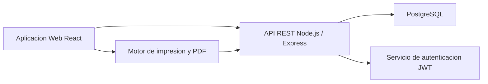
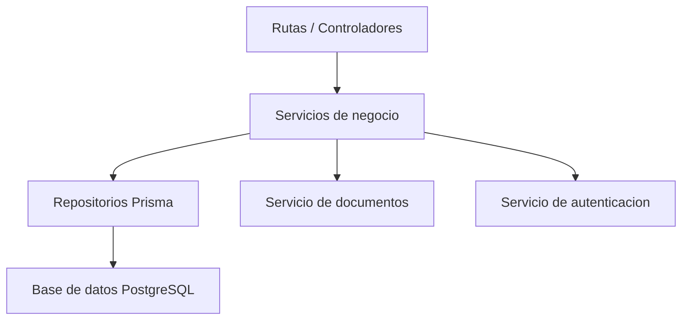
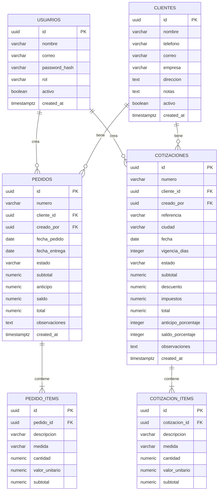

## 1. Diseno de Arquitectura


## 2. Descripcion de Tecnologias
- Frontend: React 18 + Vite + Tailwind CSS 3 + React Router + TanStack Query
- Backend: Node.js 22 + Express + driver `pg`
- Base de datos: PostgreSQL
- Autenticacion: JWT con refresh token y contrasenas cifradas con bcrypt
- Formularios: React Hook Form + Zod
- Estado UI: Zustand para filtros, paneles y preferencias locales
- Documentos: plantilla HTML/CSS imprimible con exportacion a PDF desde navegador y respaldo de datos en servidor
- Despliegue sugerido: servicio web en Render con frontend compilado + API Express y base de datos PostgreSQL de Render mediante `DATABASE_URL`

## 3. Definicion de Rutas
| Ruta | Proposito |
|------|-----------|
| /login | Acceso al sistema |
| /dashboard | Resumen operativo general |
| /clientes | Tabla y gestion de clientes |
| /clientes/:id | Ficha detallada del cliente |
| /pedidos | Lista y filtros de pedidos |
| /pedidos/nuevo | Crear pedido |
| /pedidos/:id | Ver y editar pedido |
| /cotizaciones | Lista de cotizaciones |
| /cotizaciones/nueva | Crear cotizacion |
| /cotizaciones/:id | Ver, editar, imprimir o exportar cotizacion |
| /agenda | Vista de entregas y seguimiento |
| /configuracion | Datos del negocio, firmas y plantillas |

## 4. Definiciones de API
### 4.1 Tipos Base
```ts
type RolUsuario = "ADMIN" | "OPERADOR";
type EstadoPedido = "PENDIENTE" | "EN_PROCESO" | "PAUSADO" | "ENTREGADO" | "FACTURADO" | "CANCELADO";
type EstadoCotizacion = "BORRADOR" | "ENVIADA" | "APROBADA" | "RECHAZADA" | "VENCIDA";

interface Usuario {
  id: string;
  nombre: string;
  correo: string;
  rol: RolUsuario;
}

interface Cliente {
  id: string;
  nombre: string;
  telefono?: string;
  correo?: string;
  empresa?: string;
  direccion?: string;
  notas?: string;
  activo: boolean;
}

interface ItemDocumento {
  id: string;
  descripcion: string;
  medida?: string;
  cantidad: number;
  valorUnitario: number;
  subtotal: number;
}
```

### 4.2 Endpoints Principales
| Metodo | Endpoint | Proposito |
|--------|----------|-----------|
| POST | /api/auth/login | Iniciar sesion |
| POST | /api/auth/refresh | Renovar token |
| GET | /api/dashboard/resumen | Obtener metricas y alertas |
| GET | /api/clientes | Listar clientes con filtros |
| POST | /api/clientes | Crear cliente |
| GET | /api/clientes/:id | Consultar cliente y su historial |
| PATCH | /api/clientes/:id | Actualizar cliente |
| GET | /api/pedidos | Listar pedidos |
| POST | /api/pedidos | Crear pedido |
| GET | /api/pedidos/:id | Consultar detalle de pedido |
| PATCH | /api/pedidos/:id | Actualizar pedido |
| PATCH | /api/pedidos/:id/estado | Cambiar estado del pedido |
| GET | /api/cotizaciones | Listar cotizaciones |
| POST | /api/cotizaciones | Crear cotizacion |
| GET | /api/cotizaciones/:id | Consultar cotizacion |
| PATCH | /api/cotizaciones/:id | Editar cotizacion |
| POST | /api/cotizaciones/:id/aprobar | Marcar como aprobada |
| POST | /api/cotizaciones/:id/convertir-pedido | Convertir cotizacion a pedido |
| GET | /api/cotizaciones/:id/documento | Obtener version imprimible o PDF |

### 4.3 Ejemplo de Solicitud
```ts
interface CrearCotizacionRequest {
  clienteId: string;
  referencia: string;
  ciudad: string;
  fecha: string;
  vigenciaDias: number;
  anticipoPorcentaje: number;
  saldoPorcentaje: number;
  observaciones?: string;
  items: ItemDocumento[];
}

interface CrearCotizacionResponse {
  id: string;
  numero: string;
  estado: EstadoCotizacion;
  total: number;
  urlDocumento: string;
}
```

## 5. Diagrama de Arquitectura del Servidor


## 6. Modelo de Datos
### 6.1 Definicion del Modelo


### 6.2 Lenguaje de Definicion de Datos
```sql
CREATE TABLE usuarios (
  id UUID PRIMARY KEY DEFAULT gen_random_uuid(),
  nombre VARCHAR(120) NOT NULL,
  correo VARCHAR(160) NOT NULL UNIQUE,
  password_hash VARCHAR(255) NOT NULL,
  rol VARCHAR(20) NOT NULL CHECK (rol IN ('ADMIN', 'OPERADOR')),
  activo BOOLEAN NOT NULL DEFAULT TRUE,
  created_at TIMESTAMPTZ NOT NULL DEFAULT NOW()
);

CREATE TABLE clientes (
  id UUID PRIMARY KEY DEFAULT gen_random_uuid(),
  nombre VARCHAR(160) NOT NULL,
  telefono VARCHAR(40),
  correo VARCHAR(160),
  empresa VARCHAR(160),
  direccion TEXT,
  notas TEXT,
  activo BOOLEAN NOT NULL DEFAULT TRUE,
  created_at TIMESTAMPTZ NOT NULL DEFAULT NOW()
);

CREATE TABLE pedidos (
  id UUID PRIMARY KEY DEFAULT gen_random_uuid(),
  numero VARCHAR(30) NOT NULL UNIQUE,
  cliente_id UUID NOT NULL REFERENCES clientes(id),
  creado_por UUID NOT NULL REFERENCES usuarios(id),
  fecha_pedido DATE NOT NULL,
  fecha_entrega DATE,
  estado VARCHAR(20) NOT NULL CHECK (estado IN ('PENDIENTE', 'EN_PROCESO', 'PAUSADO', 'ENTREGADO', 'FACTURADO', 'CANCELADO')),
  subtotal NUMERIC(12,2) NOT NULL DEFAULT 0,
  anticipo NUMERIC(12,2) NOT NULL DEFAULT 0,
  saldo NUMERIC(12,2) NOT NULL DEFAULT 0,
  total NUMERIC(12,2) NOT NULL DEFAULT 0,
  observaciones TEXT,
  created_at TIMESTAMPTZ NOT NULL DEFAULT NOW()
);

CREATE TABLE pedido_items (
  id UUID PRIMARY KEY DEFAULT gen_random_uuid(),
  pedido_id UUID NOT NULL REFERENCES pedidos(id) ON DELETE CASCADE,
  descripcion VARCHAR(255) NOT NULL,
  medida VARCHAR(80),
  cantidad NUMERIC(12,2) NOT NULL,
  valor_unitario NUMERIC(12,2) NOT NULL,
  subtotal NUMERIC(12,2) NOT NULL
);

CREATE TABLE cotizaciones (
  id UUID PRIMARY KEY DEFAULT gen_random_uuid(),
  numero VARCHAR(30) NOT NULL UNIQUE,
  cliente_id UUID NOT NULL REFERENCES clientes(id),
  creado_por UUID NOT NULL REFERENCES usuarios(id),
  referencia VARCHAR(255) NOT NULL,
  ciudad VARCHAR(120) NOT NULL,
  fecha DATE NOT NULL,
  vigencia_dias INTEGER NOT NULL DEFAULT 15,
  estado VARCHAR(20) NOT NULL CHECK (estado IN ('BORRADOR', 'ENVIADA', 'APROBADA', 'RECHAZADA', 'VENCIDA')),
  subtotal NUMERIC(12,2) NOT NULL DEFAULT 0,
  descuento NUMERIC(12,2) NOT NULL DEFAULT 0,
  impuestos NUMERIC(12,2) NOT NULL DEFAULT 0,
  total NUMERIC(12,2) NOT NULL DEFAULT 0,
  anticipo_porcentaje INTEGER NOT NULL DEFAULT 50,
  saldo_porcentaje INTEGER NOT NULL DEFAULT 50,
  observaciones TEXT,
  created_at TIMESTAMPTZ NOT NULL DEFAULT NOW()
);

CREATE TABLE cotizacion_items (
  id UUID PRIMARY KEY DEFAULT gen_random_uuid(),
  cotizacion_id UUID NOT NULL REFERENCES cotizaciones(id) ON DELETE CASCADE,
  descripcion VARCHAR(255) NOT NULL,
  medida VARCHAR(80),
  cantidad NUMERIC(12,2) NOT NULL,
  valor_unitario NUMERIC(12,2) NOT NULL,
  subtotal NUMERIC(12,2) NOT NULL
);

CREATE INDEX idx_clientes_nombre ON clientes(nombre);
CREATE INDEX idx_pedidos_estado ON pedidos(estado);
CREATE INDEX idx_pedidos_fecha_entrega ON pedidos(fecha_entrega);
CREATE INDEX idx_cotizaciones_estado ON cotizaciones(estado);
CREATE INDEX idx_cotizaciones_fecha ON cotizaciones(fecha);
```

## 7. Configuracion de Render
- Variable obligatoria: `DATABASE_URL` apuntando a la base PostgreSQL creada en Render.
- Variable recomendada: `JWT_SECRET` con una clave privada fuerte para produccion.
- Variable opcional: `PORT`, Render la asigna automaticamente si no se define.
- El backend inicializa las tablas base automaticamente al arrancar si no existen.
- El flujo de despliegue recomendado es compilar el frontend con `npm run build` y arrancar el servidor con `npm start`.
