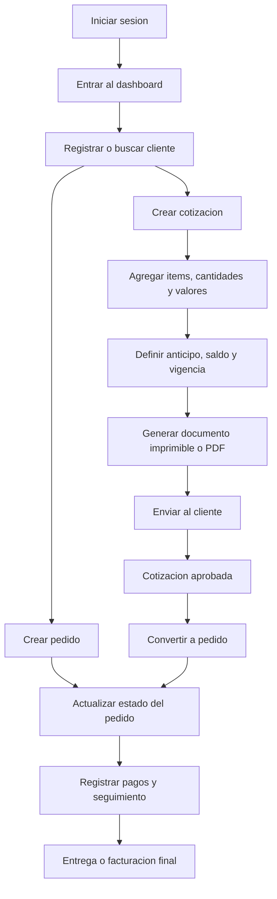

## 1. Resumen del Producto
Sistema integral para gestionar pedidos, clientes y cotizaciones desde una sola plataforma con acceso seguro, adaptable a PC y móvil.
- Resuelve el control manual de pedidos, estados, clientes, valores, anticipos y entregas, incluyendo cotizaciones formales listas para imprimir o exportar en PDF.
- Su valor principal es centralizar la operación comercial y de producción en un flujo claro, rápido y profesional.

## 2. Funcionalidades Principales

### 2.1 Roles de Usuario
| Rol | Metodo de acceso | Permisos principales |
|-----|------------------|----------------------|
| Administrador | Login con correo y contrasena | Gestionar usuarios, clientes, pedidos, cotizaciones, configuracion y reportes |
| Vendedor / Operador | Login con correo y contrasena | Crear clientes, registrar pedidos, generar cotizaciones, actualizar estados y consultar historial |

### 2.2 Modulos Funcionales
1. **Login y acceso**: autenticacion segura, recuperacion de contrasena y control por rol.
2. **Dashboard**: resumen de pedidos activos, cotizaciones recientes, pagos pendientes y entregas proximas.
3. **Clientes**: tabla de clientes con busqueda, filtros, historial comercial y datos de contacto.
4. **Pedidos**: registro de pedidos con items, valores unitarios, cliente, estado, anticipo, saldo y fecha de entrega.
5. **Cotizaciones**: creacion de cotizaciones formales con plantilla tipo documento, productos/medidas/cantidades/valor, condiciones de pago y descarga en PDF.
6. **Calendario y seguimiento**: vista semanal o por fechas para controlar entregas y avance de trabajos.

### 2.3 Detalle de Paginas
| Nombre de pagina | Modulo | Descripcion funcional |
|------------------|--------|-----------------------|
| Login | Formulario de acceso | Permite iniciar sesion, recuperar contrasena y redirigir segun rol |
| Dashboard | KPIs y alertas | Muestra resumen de pedidos, cotizaciones emitidas, pagos pendientes y proximas entregas |
| Clientes | Tabla de clientes | Lista clientes con nombre, telefono, correo, direccion, empresa, estado y acciones rapidas |
| Clientes | Ficha del cliente | Muestra datos completos, notas, pedidos asociados y cotizaciones generadas |
| Pedidos | Tabla de pedidos | Gestiona pedidos por numero, fecha, cliente, total, anticipo, saldo, estado y responsable |
| Pedidos | Editor de pedido | Permite registrar items, descripcion, valor unitario, cantidad, observaciones y fechas |
| Pedidos | Seguimiento | Actualiza estados como pendiente, en proceso, pausado, entregado o facturado |
| Cotizaciones | Lista de cotizaciones | Filtra por cliente, fecha, estado, vigencia y monto total |
| Cotizaciones | Editor de cotizacion | Genera cotizaciones con encabezado, datos del cliente, detalle de productos o servicios, condiciones de pago y firmas |
| Cotizaciones | Vista documento | Presenta la cotizacion en formato profesional, con descarga directa en PDF |
| Calendario | Agenda semanal | Organiza entregas y compromisos por fecha, cliente y estado |
| Configuracion | Datos del negocio | Administra nombre comercial, logo, firmas, politicas de pago, colores y pie de pagina |

## 3. Flujo Principal
El usuario inicia sesion, registra o selecciona un cliente, crea una cotizacion o un pedido, agrega items con sus valores y cantidades, define anticipo y saldo, guarda el documento y luego da seguimiento al estado hasta la entrega o facturacion.

Cuando una cotizacion es aprobada, el sistema puede convertirla en pedido sin duplicar la informacion. Desde el dashboard y el calendario, el equipo visualiza prioridades, pagos pendientes y entregas cercanas.

## 4. Diseno de Interfaz
### 4.1 Estilo Visual
- Colores principales: blanco, gris suave y negro para una apariencia limpia y profesional; acentos discretos en azul, verde y ambar para estados.
- Botones: redondeados medianos, con jerarquia clara entre accion primaria, secundaria y advertencia.
- Tipografia: sans serif moderna de alta legibilidad para tablas y formularios; encabezados con mayor peso visual.
- Layout: escritorio primero, con barra lateral fija en PC y navegacion simplificada en movil.
- Iconografia: limpia y funcional para clientes, pedidos, cotizaciones, calendario y pagos.

### 4.2 Resumen de Diseno por Pagina
| Nombre de pagina | Modulo | Elementos UI |
|------------------|--------|--------------|
| Login | Acceso | Tarjeta central sobre fondo blanco, formulario limpio y mensajes claros |
| Dashboard | KPIs | Tarjetas resumen limpias, tabla corta de actividad reciente y accesos rapidos |
| Clientes | Tabla principal | Tabla responsive, buscador, filtros por estado y boton de nuevo cliente |
| Pedidos | Tabla y formulario | Columnas densas en PC, tarjetas por pedido en movil, chips de estado y resumen de pagos |
| Cotizaciones | Editor documento | Formulario estructurado y vista previa tipo hoja empresarial con cabecera y firma |
| Calendario | Agenda | Vista semanal compacta en PC y lista cronologica en movil |

### 4.3 Responsividad
- En PC prioriza productividad con tablas amplias, filtros visibles y panel lateral.
- En movil adapta tablas a tarjetas, formularios a pasos cortos y acciones grandes para toque.
- El sistema debe permitir generar cotizaciones, consultar clientes y actualizar estados desde telefono sin perder claridad.

### 4.4 Guia del Documento de Cotizacion
- Encabezado con ciudad, fecha, nombre del cliente y referencia del servicio o producto.
- Bloque introductorio con saludo y descripcion corta de la propuesta.
- Tabla principal con columnas de producto, medidas, cantidad, valor unitario y total.
- Seccion de condiciones de pago con anticipo, saldo, vigencia y notas.
- Area de firmas o responsables configurables.
- Formato visual limpio, formal, sin textos innecesarios y con descarga directa en PDF.
